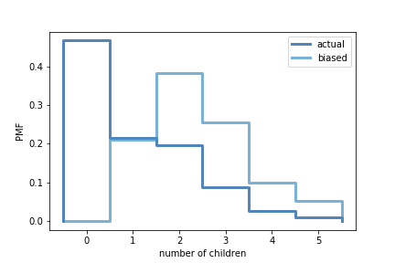

[Think Stats Chapter 3 Exercise 1](http://greenteapress.com/thinkstats2/html/thinkstats2004.html#toc31) (actual vs. biased)

Exercise 3.1.
Something like the class size paradox appears if you survey children and ask how many children are in their family. Families with many children are more likely to appear in your sample, and families with no children have no chance to be in the sample.

Use the NSFG respondent variable `numkdhh` to construct the actual distribution for the number of children under 18 in the respondents' households.

Now compute the biased distribution we would see if we surveyed the children and asked them how many children under 18 (including themselves) are in their household.

Plot the actual and biased distributions, and compute their means.

>> The actual mean is approximately 1.02 children per household. However, if the children were surveyed, then there would be a biased mean of approximately 2.40 children per household.

```python
import numpy as np
import matplotlib.pyplot as plt

import nsfg
import first
import thinkstats2
import thinkplot

def BiasPmf(pmf, label):
    new_pmf = pmf.Copy(label=label)

    for x, p in pmf.Items():
        new_pmf.Mult(x, x)
        
    new_pmf.Normalize()
    return new_pmf


resp = nsfg.ReadFemResp()

# calculate PMF
actual_pmf = thinkstats2.Pmf(resp['numkdhh'], label='actual')
biased_pmf = BiasPmf(actual_pmf, label='biased')

# plot both PMFs on a single plot
thinkplot.PrePlot(2)
thinkplot.Pmfs([actual_pmf, biased_pmf])
thinkplot.Config(xlabel='number of children', ylabel='PMF')
plt.savefig('actual_biased_pmf.png')
```



```python
# calculate means
print(actual_pmf.Mean(), biased_pmf.Mean())
```