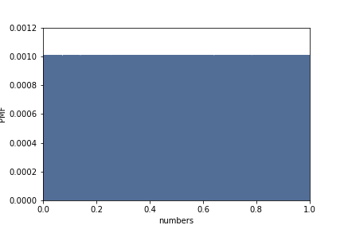
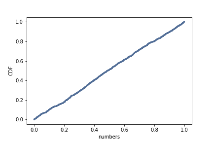

[Think Stats Chapter 4 Exercise 2](http://greenteapress.com/thinkstats2/html/thinkstats2005.html#toc41) (a random distribution)

Exercise 4.2.
The numbers generated by `numpy.random.random` are supposed to be uniform between 0 and 1; that is, every value in the range should have the same probability.

Generate 1000 numbers from `numpy.random.random` and plot their PMF.  What goes wrong?

Now plot the CDF. Is the distribution uniform?

>> The PMF plot of the sampled numbers resembles a solid rectangle and is difficult to read. The CDF plot shows a straight diagonal line, thus revealing a uniform distribution of sampled numbers.

```python
import numpy as np
import matplotlib.pyplot as plt

import nsfg
import first
import thinkstats2
import thinkplot

np.random.seed(123)
sample = np.random.random(1000)
sample[:10]

# PMF
sample_pmf = thinkstats2.Pmf(sample)
thinkplot.Pmf(sample_pmf)
thinkplot.Config(xlabel='numbers', ylabel='PMF', axis=[0, 1, 0, .0012])
plt.savefig('sample_pmf.png')
```


```python
# CDF
sample_cdf = thinkstats2.Cdf(sample)
thinkplot.Cdf(sample_cdf)
thinkplot.Config(xlabel='numbers', ylabel='CDF')
plt.savefig('sample_cdf.png')
```


